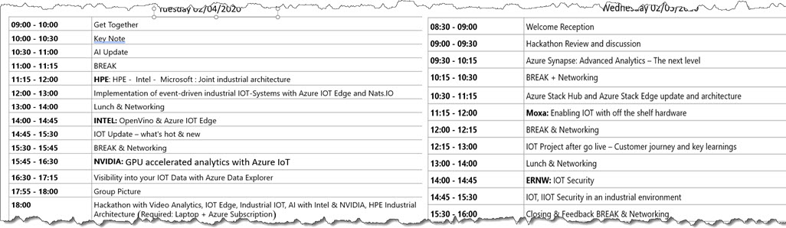

# 
 Microsoft IOT and AI Summit 
 # 
## 
 02/04 - 02/05 2020 Microsoft Office Munich 
 ##
 
Thank you all for your attendance. It was a real pleasure to have you on board. As promised here are the information from the speakers as I got the approval to publish. Unfortunately some information are __NDA__ only and cannot be shared in a public place. So please contact the speaker directly. 

But first the agenda:

### Slideshare:

As soon as I get the permission and the slidedeck from the speakers, I will publish them here:

[Intel: Open Vino & Azure IOT Edge](https://github.com/DittmannAxel/AI_IOT_Summit_Feb20/blob/masterIntelOpenVINO_MicrosoftAI_IoTWorkshop.pdf), Contact: Roy Allela: <roy.m.allela@intel.com> and Christian Donitzky: <christian.donitzky@intel.com>    
[NVIDIA's presentation on AI & IOT Edge](https://github.com/DittmannAxel/AI_IOT_Summit_Feb20/blob/master/GPU_Accelerated_Analytics_Azure_IoT.pdf), Contact: Dr. Ulrich Knechtel: <uknechtel@nvidia.com>,  Teresa Conceicao: <tconceicao@nvidia.com>  
[HPE, Intel and Microsoft Industrial Architecture](https://github.com/DittmannAxel/AI_IOT_Summit_Feb20/blob/master/HPE_INTEL_MSFT_industrial_architecture.pdf), Contact: Jochen Mohr <Jochen.Mohr@HPE.com>, Axel Dittmann <Axel.Dittmann@Microsoft.com>  
[Moxa: Enabling IOT ](https://github.com/DittmannAxel/AI_IOT_Summit_Feb20/blob/master/MSFT_AI_IoT_Summit_MoxaDeviceMgt.pdf), Contact: Christian Gromeier: <Christian.Gromeier@moxa.com>
 
[ERNW: IOT Security ](https://github.com/DittmannAxel/AI_IOT_Summit_Feb20/blob/master/ERNW_IoTSec_v1.0.pdf), Contact: Christoph Klaasen: <cklaassen@ernw.de>
 
IOT Update - __NDA__ session, Contact: Vitaliy Slepakov directly: <Vitaliy.Slepakov@Microsoft.com>
 

